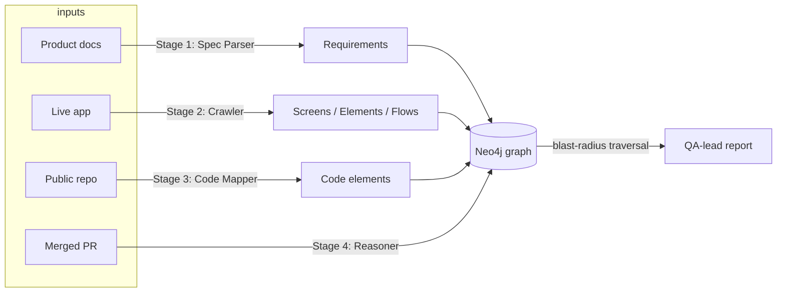
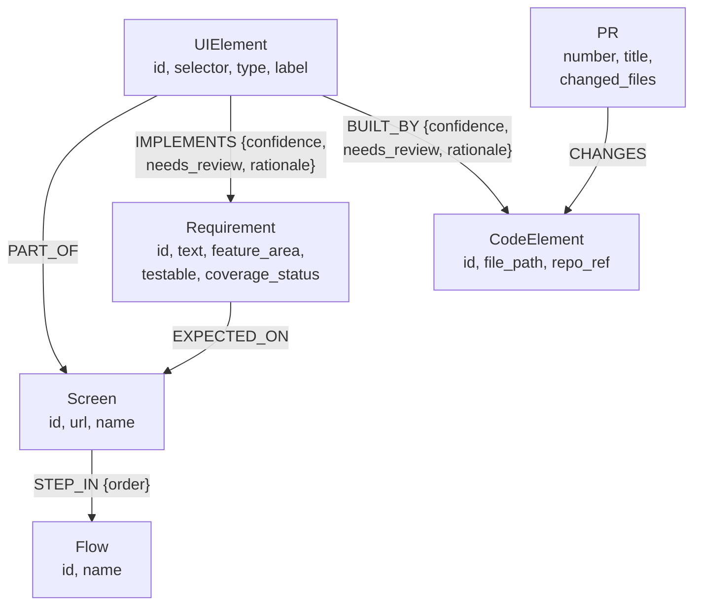

# Design Document — knowledge-graph-agent

*Blast-radius reasoning over a Requirements ↔ UI ↔ Code knowledge graph.*

---

## 1. Problem and shape of the solution

Given a code change (a merged PR) to a real web application, answer: **what UI
elements, user flows, and product requirements are put at risk?** — in a form
a QA lead who knows the product but not the codebase can act on.

The reason this is hard is that it requires connecting three worlds that
normally never meet in one data structure:

- the **spec** — what the product is supposed to do (intent),
- the **rendered UI** — what was actually built (observable behavior),
- the **source code** — how it was built (the thing PRs change).

Each pair of layers has a different linking problem with a different error
profile: spec↔UI linking is a semantic-matching problem, UI↔code linking is a
provenance problem, and code↔PR linking is exact. The architecture follows
from taking those differences seriously instead of treating "build a graph"
as one undifferentiated LLM task.

Target application: **Cal.com** (app.cal.com), repo `calcom/cal.com` (the
sample run used the `calcom/cal.diy` community fork — identical monorepo
layout). Chosen deliberately:

- its booking and event-type journeys are **multi-screen**, so the Flow layer
  has real depth rather than being a decoration;
- the codebase uses `data-testid` attributes pervasively, which makes the
  deliberately-cut code-mapping layer *honest* — a heuristic can be right
  often enough to be useful, and measurably wrong the rest of the time,
  rather than uniformly hopeless;
- both the app and the repo are public, so every claim in this document is
  reproducible.



---

## 2. Agent decomposition

*(brief §5 — stages, boundaries, deterministic vs. LLM-driven)*

The system is a **four-stage single-pass pipeline around one shared graph**,
not a chain of prompts. The test I applied to every component: *if the LLM
were replaced by a human contractor filling in JSON, would the system still
work identically?* Everywhere the answer must be "yes" — the LLM produces
**data** (validated against Pydantic schemas), never **control flow**. All
sequencing, retries, graph writes, traversal, and arithmetic are ordinary
code.

### 2.1 The stages and their boundaries

| Stage | Input contract | Output contract | Deterministic parts | LLM parts |
|---|---|---|---|---|
| 1. Spec Parser | doc URL/file | `SpecParseResult` | fetch, HTML→text, slug generation, dedup | extracting atomic testable requirements |
| 2. Crawler | fixed screen list + credentials | `CrawlResult` | Playwright navigation, element capture, selector synthesis, screenshot/DOM artifacts | semantic labeling of each element's purpose |
| 3. Graph Builder | stages 1+2 outputs, repo | graph + edges | all node upserts, `data-testid` grep, token-overlap ranking, confidence thresholds, coverage stamping | Requirement↔UIElement matching; code-map fallback *choice among heuristic-shortlisted candidates* |
| 4. Reasoner | PR number | `BlastRadiusReport` | GitHub PR fetch, file→CodeElement matching, graph traversal, confidence multiplication, dedup/ranking, the no-match report | the prose summary only |

The stage boundaries are the Pydantic models in `app/models.py`. Each stage
consumes and produces typed objects; only `app/graph/client.py` knows Cypher.
This means any stage can be re-run in isolation (all graph writes are
idempotent `MERGE` upserts), stages can be tested with synthetic data (the
smoke test exercises the entire graph layer with zero LLM calls), and an LLM
regression in one stage cannot corrupt another stage's logic — only its data,
which carries confidence scores precisely so downstream consumers can
discount it.

### 2.2 Why each LLM placement is where it is

An LLM earns its place in exactly four spots, each chosen because the task is
*classification/extraction over unstructured input* — the one thing rules
can't do — and each fenced so its failure mode is bounded:

1. **Requirement extraction** (stage 1). Docs are prose; turning them into
   atomic, testable statements is irreducibly semantic. Fenced by: schema
   validation with one corrective retry, and a `testable` flag so
   non-verifiable statements are kept but excluded from coverage math.
2. **Element labeling** (stage 2). `[data-testid="confirm-book-button"]` →
   "confirm booking" is trivial; `#_r_28_` (an unstable React-generated id)
   → "invitee name input" requires reading context. Fenced by: labels are
   descriptive metadata; a wrong label degrades matching quality but cannot
   break traversal.
3. **Requirement↔UI linking** (stage 3). The core semantic join. Fenced by:
   confidence per edge, `needs_review` below threshold, and — critically —
   **hallucinated IDs are dropped at the boundary** (`req_linker.py` verifies
   every returned ID against the actual element/requirement sets before
   writing).
4. **Code-map fallback** (stage 3). The LLM never free-associates a file
   path; it *chooses among candidates the deterministic heuristic already
   shortlisted*, and its choice carries its own (instructed-to-be-
   conservative) confidence. Fenced by: the candidate list itself comes from
   the repo tree, so the LLM cannot invent a nonexistent file.
5. **Report generation** (stage 4). Prose for a non-engineer. Fenced by: it
   renders *already-computed* structured findings; it cannot add or remove an
   affected item. When the traversal finds nothing, the report is generated
   by a deterministic template — no LLM involved — because "no impact found"
   is exactly the message that must never be embellished.

Conversely, three things that might look like LLM jobs are deliberately
**not**:

- **Blast-radius traversal** is one Cypher query. Asking an LLM "what might
  this PR affect?" produces plausible text; traversing recorded edges
  produces an *auditable* answer where every line traces to a specific edge
  with a specific confidence and rationale.
- **Confidence arithmetic** (multiplication along the path, threshold
  bucketing) is code, so the same graph always yields the same report
  structure.
- **PR→code matching** is exact path matching against the diff. No judgment
  is needed, so none is used.

### 2.3 Failure policy: single-pass, no self-healing

A screen that fails to load is logged and skipped. An LLM response that fails
schema validation gets exactly one corrective retry (with the validation
error fed back verbatim), then raises. This is a deliberate stance for a
prototype: retry loops and self-healing agents *hide* failure modes at the
exact moment you most need to see them. The crawl of the sample run
demonstrates the value — four authenticated screens failed cleanly (no test
account was configured), the pipeline continued, and the absence layer
correctly reported the consequences rather than papering over them.

---

## 3. Graph schema

*(brief §6 — node/edge types, cross-layer connections, absence, justifying
query)*

### 3.1 Schema



Six node types, six edge types. Every node ID is a deterministic slug with a
uniqueness constraint, and every write is a `MERGE` upsert — re-running any
stage converges the graph instead of duplicating it. The two **cross-layer**
edges (`IMPLEMENTS`, `BUILT_BY`) are the only LLM-influenced edges, and they
are the only edges that carry `confidence` / `needs_review` / `rationale`.
That asymmetry is the point: within-layer structure (`PART_OF`, `STEP_IN`) is
observed directly by the crawler and is trustworthy; cross-layer links are
inferred and must say how much to trust them.

`STEP_IN` carries an `order` property so flows are sequences, not sets — a
change to step 1 of a flow is operationally different from a change to step 4,
and the report can eventually say so.

### 3.2 The query the schema is designed for

The blast radius is one traversal:

```
(PR)-[:CHANGES]->(CodeElement)<-[:BUILT_BY]-(UIElement)
        ├─[:PART_OF]->(Screen)-[:STEP_IN]->(Flow)
        └─[:IMPLEMENTS]->(Requirement)
```

`PR→CodeElement` is exact (paths from the diff), so path confidence is
`built_by.confidence × implements.confidence`. Results are deduplicated per
(element, screen, flow, requirement) keeping the strongest path, then split
into `affected` vs. `needs_review`. The schema decisions above are justified
by this query: cross-layer confidence must live *on the edges* (not the
nodes) because the same UIElement can reach the same Requirement through
paths of different quality, and the traversal needs to rank paths, not nodes.

### 3.3 Modeling absence

The question the schema must answer: *which requirements should be testable
but are reflected nowhere in the captured UI?*

Two designs were considered:

**Option A — a `Gap` / `MissingImplementation` node type.** Rejected. Absence
is a *derived* fact: it becomes false the instant a new `IMPLEMENTS` edge
lands. Materializing it as a node turns a query result into stored state that
every writer must now maintain, and invites the worst failure mode — a stale
`Gap` node asserting a gap that no longer exists.

**Option B — absence as the negative space of the graph (chosen).** A
testable `Requirement` with no incoming `:IMPLEMENTS` edge *is* the gap:

```cypher
MATCH (r:Requirement) WHERE r.testable = true
OPTIONAL MATCH (u:UIElement)-[e:IMPLEMENTS]->(r)
WITH r, count(e) AS total,
     sum(CASE WHEN e IS NOT NULL AND NOT e.needs_review THEN 1 ELSE 0 END) AS confident
WHERE total = 0 OR confident = 0
RETURN r, CASE WHEN total = 0 THEN 'not_found' ELSE 'ambiguous' END AS status
```

Note the query distinguishes two *kinds* of absence, and the distinction is
operationally meaningful to a QA lead:

- `not_found` — no edge at all: either the feature is missing, or the crawl
  didn't reach its screen. Action: check crawl scope first, then the product.
- `ambiguous` — only low-confidence edges exist: the agent *thinks* it saw
  the feature but isn't sure. Action: a human looks at the flagged edge and
  its recorded rationale.

One denormalization: the query's answer is also stamped onto each
`Requirement` as a `coverage_status` property (`covered` / `ambiguous` /
`not_found`), recomputed in one pass after every graph build. This is a
read-path cache of the canonical query — never hand-written, always
derivable — so the common dashboard question "list uncovered requirements"
costs an index lookup instead of a traversal. The graph stays the source of
truth; the property is allowed to be one build behind it.

The sample run shows absence working as designed: 9 of 19 requirements
surfaced as uncovered, and the breakdown is *diagnostic* — six are
auth-gated screens the crawl (correctly, by scope) never reached, two live
on booking-management pages outside the fixed screen list, and one is
`ambiguous` because the crawled user's booker skips the event-list page,
leaving only a 0.4-confidence link that the system refused to count as
coverage.

---

## 4. Confidence handling under ambiguity

*(brief §7 — representation, propagation, and when a human is asked)*

### 4.1 Representation

Every LLM-produced edge carries `confidence: float` (0–1), a one-line
`rationale`, and a derived `needs_review: bool` stamped by comparing against
a single global threshold (`0.5`, configurable). The rationale is not
decoration — it is what a human reviews when the system escalates, and in the
sample run it is what exposed a heuristic false positive (`google` matching a
CSP allowlist file rather than the login button).

Heuristic (non-LLM) confidences are calibrated by construction, not learned:
a unique `data-testid` match is 0.9 (near-provenance), a 2–3-file match is
0.55 (right neighborhood, wrong precision), token-overlap matches cap at 0.6.
The LLM fallback is *instructed* to be conservative and to return 0 when no
candidate is plausible — and a 0-confidence answer results in **no edge**,
which is itself information (it feeds the absence layer).

### 4.2 Propagation

Confidence **multiplies along the traversal path**. A 0.9 UI→code link
through a 0.6 code-change association yields a 0.54 finding, which lands in
the report's uncertain bucket. Multiplication is deliberately punishing: a
chain of plausible guesses should *not* accumulate into a confident
conclusion, and the weakest link should dominate. The alternative
(max/average) lets two mediocre links masquerade as one good one.

The two brief-named ambiguity cases resolve concretely:

- *"The PRD describes a feature you can't find in the UI"* → no `IMPLEMENTS`
  edge is forced (the linker is explicitly told unmatched requirements are
  expected and meaningful) → the requirement surfaces as `not_found` /
  `ambiguous` in the absence query. Silence is a first-class outcome.
- *"The code change touches a function you can't map to a UI element"* → no
  `BUILT_BY` path → the PR's report deterministically states the change is
  **unassessed, not safe** ("this can mean the change is backend-only, or
  that it lands outside the crawled screens"). The sample run includes a
  real instance (PR #29940, an email-header fix).

### 4.3 When the system stops and asks a human

The system never blocks mid-pipeline waiting for input — it is single-pass —
but it **routes** to humans at three defined points:

1. **Edge level**: any cross-layer edge below threshold is `needs_review`.
   It stays in the graph (so traversal can still find it) but is excluded
   from confident conclusions and listed separately.
2. **Requirement level**: `ambiguous` coverage status is precisely the
   "human should look at this" queue for the spec↔UI join.
3. **Report level**: the blast-radius report has a mandatory "Uncertain —
   needs human review" section whenever any path confidence falls below
   threshold, and the report is instructed to say *why* it's uncertain
   (automated mapping) rather than hedging vaguely.

The design principle: **uncertainty is routed, never silently included and
never silently dropped.** Both failure modes are worse than the extra review
queue — silent inclusion erodes trust in confident findings; silent dropping
recreates the exact blind spot this system exists to eliminate.

---

## 5. Eval approach

*(brief §8 — how do we know the output is right; the 100-runs question)*

### 5.1 What is actually variable across 100 runs

The honest answer to "run it 100 times, which runs were correct?" starts by
decomposing where variance can even enter:

- **Deterministic given inputs** (would be *identical* across 100 runs on
  pinned inputs): graph writes, ID generation, heuristic code mapping,
  confidence arithmetic, traversal, bucketing, the no-match report. This is
  most of the system by line count, and it is covered today by a smoke test
  that seeds a synthetic three-layer graph, writes everything **twice** (to
  prove upsert idempotency), and asserts coverage stamping, the absence
  query, and exact path-confidence values (0.9 × 0.9 = 0.81).
- **Environment-variable** (changes when the world changes, not per-run): the
  live app's DOM, the docs content, GitHub API results. Controlled by pinning:
  crawl artifacts (DOM + screenshots are already saved per run), a repo
  commit hash, a cached docs snapshot.
- **Genuinely stochastic**: the five LLM call sites. This is the *only*
  place run-to-run disagreement can originate — so an eval harness should
  spend nearly all its budget here.

### 5.2 The harness I would build (and the golden set I have)

What exists now is the scoped-down version: a **small hand-verified golden
set** — for the sample PR (#28534, a DatePicker change), the expected
affected screen (public booker), flow (book a slot), and requirements were
enumerated by hand before running the traversal, and the output was checked
against them. That validates the pipeline end-to-end exactly once, which is
the right investment at prototype stage but is not an eval.

The real harness, per layer, in the order I'd build it:

1. **Edge-level precision/recall** (highest value). Hand-label ~50
   (UIElement, Requirement) pairs and ~50 (UIElement, file) pairs across the
   crawled screens. Run the linkers N times; measure precision/recall *per
   confidence band*. This does double duty: it scores the LLM stages **and
   calibrates the threshold** — the current 0.5 is a placeholder, and the
   correct value is "the confidence above which measured precision exceeds
   what a QA lead will tolerate." It also converts "100 runs" from a problem
   into a measurement: run-to-run edge variance *is* the stability metric,
   reported alongside accuracy.
2. **Report-level recall against history**. Mine ~20 historical PRs whose
   linked issues show where a regression actually surfaced; score whether the
   blast radius contained that screen/flow (recall@report). This is the only
   metric that measures the system's actual job, and it produces an honest
   headline number ("caught the regression surface in K of 20").
3. **Absence-level seeded canaries**. Inject requirements known to be
   unimplemented into the spec; assert they surface as `not_found` and are
   never claimed `covered`. A false "covered" is the most dangerous single
   output this system can produce — it tells a QA lead not to look — so it
   gets its own regression gate.

All three run on pinned inputs (fixed crawl artifacts, fixed repo commit,
fixed doc snapshot) so LLM behavior is the only moving part between runs.

---

## 6. Scope decisions

*(brief §9 — what was cut, what went deep, and why)*

The depth budget went to **Graph** (schema + absence) and **Reason**
(traversal + report) — the two layers that constitute the actual intelligence
of the system and the two the assignment weights hardest. The cuts, each a
decision rather than an omission:

**Cut 1 — Fixed crawl list, not autonomous exploration.** The brief says
"explores autonomously"; this system crawls a declared list of seven
high-value screens with declared flows (one screen — the booking form —
is reached by a declared read-only interaction, since it has no stable URL). Open-ended crawling of an
authenticated production app is its own project — loop detection, state
pollution, destructive-action safety (an autonomous agent that clicks
"delete event type" on a real account is a bug with consequences). More
importantly, autonomous exploration improves *coverage breadth*, while the
assignment's hard questions (absence, confidence, blast radius) are all
about *reasoning depth over whatever was captured*. A fixed list keeps the
crawl deterministic and reproducible, which section 5 then relies on.
What was kept from the spirit of the requirement: structured artifacts (DOM
snapshots, screenshots, per-element capture with stable selector synthesis)
and screen-to-screen flow relationships.

**Cut 2 — Heuristic code mapping, no static analysis.** UI→code mapping is
`data-testid` search (unique hit ⇒ 0.9), then filename/label token overlap,
then an LLM choosing among the shortlist. No AST parsing, no import
resolution, no call graph. This is the most explicitly cut layer, and the
confidence machinery exists precisely so a cut layer can be honest about its
own quality instead of pretending. The sample run quantifies the trade: the
unique-testid tier was verified correct everywhere it fired; the ambiguous
tier produced a real false positive (caught and corrected by the fallback,
with the correction recorded on the edge). A notable consequence of the
layer's simplicity: when the planned local clone of the monorepo failed, the
mapper was reimplemented against the GitHub tree + code-search APIs
(`map_elements_remote`) in under an hour — cheap layers are also cheap to
re-platform.

**Cut 3 — Single-pass pipeline, no retry/self-healing loops.** Argued in
§2.3. Failures surface; they don't spin.

**Cut 4 — Golden set instead of an eval harness.** Argued in §5.2. The full
harness design is written down; one hand-verified end-to-end case is what 16
hours buys.

**Cut 5 — No write-path UI coverage.** The crawler observes but never
submits forms (it clicks through to the booking form but does not book).
This bounds the crawl's blast radius on a production system to zero — a
constraint I'd hold even with more time, solved properly only by a sandboxed
deployment of the target app.

---

## 7. What I would do with another week

*(brief §10 — three highest-value items, in order)*

**1. The edge-level eval set + threshold calibration (~2 days).**
Reasoning: every downstream consumer — the review queue, the report's
confident/uncertain split, the absence statuses — keys off confidence values
that are currently designed-but-uncalibrated. ~100 hand-labeled pairs turn
the threshold from a guess into a measured operating point and produce the
per-stage precision numbers that every conversation about trusting this
system eventually demands. It is first because it de-risks everything else:
improving a layer you can't measure is guesswork.

**2. Real code provenance for the top of the funnel (~3 days).**
Replace the filename heuristic with cheap-but-real analysis for the highest-
traffic case: parse the repo's TSX with tree-sitter, index every literal
`data-testid` and translation key to its defining component, then walk the
import graph one level up. This converts the 0.55-confidence tier (the tier
that produced the sample run's false positive) into 0.9-provenance mappings,
and — because BUILT_BY confidence multiplies into every blast-radius path —
it lifts the certainty of the *entire* report, not just one layer. Second
rather than first only because item 1 is what proves the lift.

**3. Crawl expansion: authenticated screens + one interaction depth (~2 days).**
Log in with a dedicated test account, capture the four authenticated screens
already declared in the flow definitions, and extend the crawler's existing
interaction mechanism (currently a single click-to-reach step for the booking
form) to open modals/menus — never submitting — to capture elements the
visible-DOM crawl misses. Reasoning: the absence layer currently reports six requirements as
`not_found` for the honest-but-unsatisfying reason that their screens were
never visited; this item converts crawl-scope absences into real
product-coverage signal. Third because it multiplies the *value* of the graph
while items 1–2 multiply its *trustworthiness* — and trust compounds first.

Explicitly *not* in the top three: autonomous exploration (breadth before
trust is backwards), multi-PR batch analysis (trivial once single-PR is
trusted), and UI polish on the report (the report's consumer needs accuracy,
then formatting).

---

## 8. Known limitations

Stated plainly, beyond the scope cuts above:

- Code mapping ignores non-component code (API routes, hooks, server logic).
  A PR touching only `packages/lib` returns "unassessed" — correct behavior,
  but a standing gap between "unassessed" and "assessed safe" that item 2
  above narrows.
- Element capture is visible-DOM only; content behind interactions is
  missed until the item-3 crawl expansion.
- Requirement quality is bounded by the source doc's specificity; a vague
  spec yields vague requirements, garbage-in unchanged.
- One mislabeled element can propagate through both of its cross-layer
  edges. Confidence multiplication bounds the damage (both edges carry the
  doubt); it does not eliminate it.
- The `coverage_status` cache can be one build stale relative to the live
  edge set — accepted by design (§3.3), but a consumer reading the property
  without ever running the canonical query inherits that staleness.
